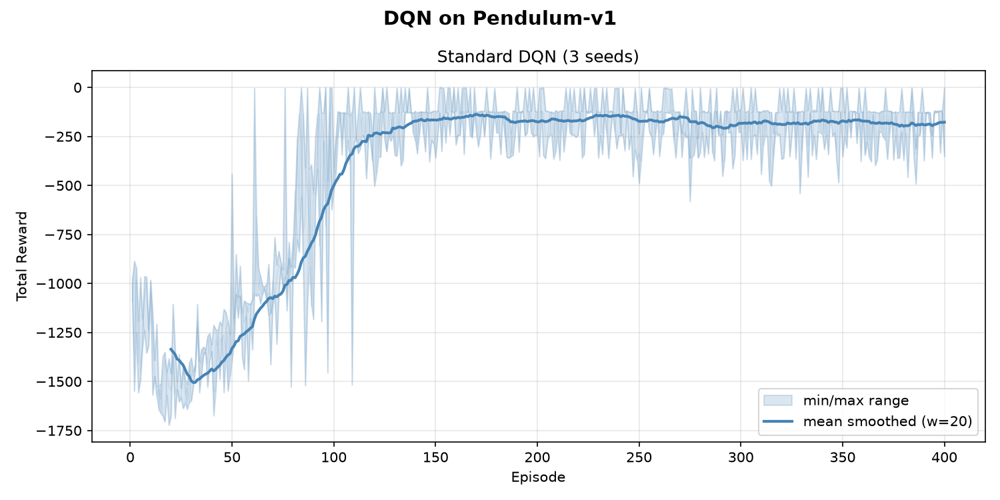
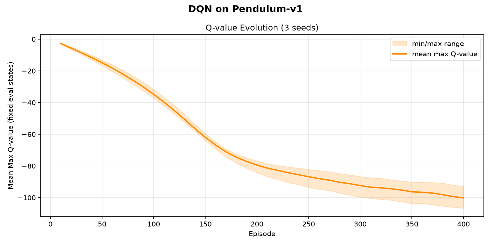

# DQN on Pendulum-v1

A Deep Q-Network (DQN) implementation applied to the `Pendulum-v1` environment from [Gymnasium](https://gymnasium.farama.org/).

Since DQN requires a **discrete** action space but Pendulum has a **continuous** torque action in `[-2, 2]`, the action space is discretized into a fixed uniform grid of bins.

---

## Environment

| Property | Value |
|---|---|
| Environment | `Pendulum-v1` |
| Observation space | 3D continuous `[cos θ, sin θ, θ̇]` |
| Action space | Continuous torque in `[-2, 2]` → discretized to `N_ACTIONS` bins |
| Episode length | Max 200 steps |
| Reward | Negative cost: closer to upright = higher reward (less negative) |

---

## Method

The continuous action space is discretized by mapping each integer action index to an evenly-spaced torque value via `np.linspace(-2, 2, N_ACTIONS)`. The agent selects a discrete bin; the corresponding torque is passed to `env.step()`.

### Architecture

A two-hidden-layer MLP Q-network:

```
Input (3) → Linear(256) → ReLU → Linear(256) → ReLU → Linear(N_ACTIONS)
```

### Key DQN Components

| Component | Details |
|---|---|
| Experience replay | `ReplayBuffer` with capacity 100,000 |
| Target network | Hard-synced every 10 episodes |
| Exploration | ε-greedy with exponential decay |
| Loss | Huber loss (Smooth L1) |
| Optimizer | Adam, lr = 1e-3 |
| Gradient clipping | Max norm 10.0 |

---

## Hyperparameters

| Parameter | Value | Description |
|---|---|---|
| `N_ACTIONS` | 11 | Number of discrete torque bins |
| `HIDDEN_SIZE` | 256 | Hidden layer size |
| `LR` | 1e-3 | Adam learning rate |
| `GAMMA` | 0.99 | Discount factor |
| `BUFFER_SIZE` | 100,000 | Replay buffer capacity |
| `BATCH_SIZE` | 64 | Mini-batch size |
| `EPS_START` | 1.0 | Initial epsilon |
| `EPS_END` | 0.05 | Minimum epsilon |
| `EPS_DECAY` | 5,000 | Exponential decay rate (in steps) |
| `TARGET_UPDATE` | 10 | Episodes between target network syncs |
| `N_EPISODES` | 400 | Training episodes per seed |
| `MAX_STEPS` | 200 | Max steps per episode |

The epsilon schedule follows:

$$\varepsilon_t = \varepsilon_{\text{end}} + (\varepsilon_{\text{start}} - \varepsilon_{\text{end}}) \cdot e^{-t / \text{EPS\_DECAY}}$$

---

## Results

Training is repeated across 3 independent seeds `[42, 0, 1]`. The reward plot shows:
- Faint lines: individual seed traces
- Shaded band: min/max range across seeds
- Solid line: smoothed mean (window = 20 episodes)

Typical final performance (last 50 episodes, mean across seeds): **~ −150 to −250**

The optimal reward for a perfect upright balance is approximately **−120 to −150**.



The Q-value evolution plot tracks the **mean max Q-value** on 20 fixed evaluation states sampled before training. Q-values decrease from ~0 toward negative values as the network learns the true (negative) returns of the Pendulum task, and decelerate once the reward curve converges.



---

## Outputs

| File | Description |
|---|---|
| `dqn_pendulum_results.png` | Learning curve with min/max band across seeds |
| `dqn_q_values.png` | Mean max Q-value on fixed eval states, averaged across seeds |
| `dqn_pendulum.gif` | Greedy policy rollout of the best-performing trained agent |


---

## Installation

```bash
python -m venv venv
source venv/bin/activate
pip install torch numpy gymnasium[classic_control] matplotlib imageio
```

## Usage

```bash
python DQN_on_Pendulum.py
```

This will:
1. Train the DQN agent for each seed in `SEEDS`
2. Plot the learning curve and save it as `dqn_pendulum_results.png`
3. Plot the Q-value evolution and save it as `dqn_q_values.png`
4. Record a GIF of the best-performing agent and save it as `dqn_pendulum.gif`

---

## Code Structure

| Symbol | Type | Description |
|---|---|---|
| `ReplayBuffer` | class | Fixed-capacity circular buffer storing `(s, a, r, s', done)` transitions |
| `QNetwork` | class | MLP mapping states to Q-values for all actions |
| `select_action` | function | ε-greedy action selection |
| `train_step` | function | One Bellman update on a sampled mini-batch |
| `epsilon` | function | Exponential ε decay schedule |
| `make_action_map` | function | Builds the discrete torque lookup table |
| `eval_q_values` | function | Mean max Q-value over a fixed set of probe states |
| `run_standard_dqn` | function | Full training loop for one seed |
| `run_multiple_seeds` | function | Runs training across all seeds, returns best network |
| `smooth` | function | Moving-average filter for plotting |
| `plot_results` | function | Learning curve with min/max band |
| `plot_q_values` | function | Q-value evolution with min/max band across seeds |
| `record_gif` | function | Records one greedy episode as a GIF |
