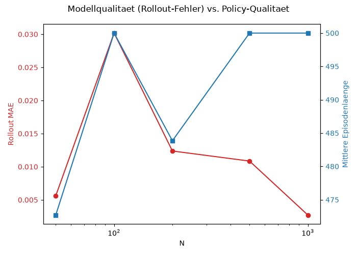

# Aufgabe 4.2 — Vergleich Modellqualität vs. Policyqualität

| N    | Rollout-MAE | Mittlere Performanz | Std   |
| ---- | ----------- | ------------------- | ----- |
| 50   | 0.005611    | 472.70              | 46.72 |
| 100  | 0.030178    | 500.00              | 0.00  |
| 200  | 0.012375    | 483.85              | 70.40 |
| 500  | 0.010853    | 500.00              | 0.00  |
| 1000 | 0.002705    | 500.00              | 0.00  |

Es zeigt sich **kein konsistenter Zusammenhang** zwischen Modell- und Policy-Qualität:

- N=1000 hat den niedrigsten Rollout-Fehler (0.0027) und erreicht die maximale Performanz (500) — hier passt die Erwartung.
- N=100 hat dagegen den **höchsten** Rollout-Fehler (0.0302), erreicht aber trotzdem die maximale Performanz (500) — widerspricht der Erwartung.
- N=50 hat einen der niedrigsten Rollout-Fehler (0.0056), aber die **schlechteste** Performanz (472.70, hohe Streuung).
- N=200 liegt bei mittlerem Rollout-Fehler, zeigt aber die schwächste und instabilste Performanz (483.85, Std=70.40).

Insgesamt: 3 von 5 Policies (N=100, 500, 1000) erreichen den Decken-Effekt von 500 Schritten trotz unterschiedlicher Modellqualität, während N=50 und N=200 darunter liegen — ohne dass ihre Modellfehler das erklären.

# Aufgabe 4.3 — Diskussion der Leitfragen

**1. Ab welcher Datenmenge entstehen deutliche Verbesserungen?**
Kein sauberer monotoner Trend: N=50→100 verbessert die Performanz deutlich (472.7→500), aber N=200 fällt wieder ab (483.85). Erst ab N=500 ist die maximale Performanz stabil erreicht.

**2. Gibt es Sättigungseffekte bei Modell- oder Policy-Qualität?**
Bei der Policy ja — ab N=500 liegt die Performanz konstant beim technischen Maximum (500, Std=0). Bei der Modellqualität kein klarer Sättigungspunkt erkennbar; der Fehler schwankt uneinheitlich über N (kein monotoner Abfall).

**3. Welche typischen Fehler zeigen sich bei kleinen Datensätzen?**
N=50 und N=200 zeigen die größte Streuung zwischen den 20 Startzuständen (Std=46.7 bzw. 70.4) — die Policy ist also nicht durchgängig stabil, sondern versagt bei einem Teil der Startzustände deutlich früher. Das deutet auf ungleichmäßige Abdeckung des Zustandsraums im Dynamik-Modell hin.

**4. Spiegelt gute Forecast-Qualität automatisch gute Policy-Performanz wider?**
Nein. N=100 widerlegt das direkt: schlechtester Rollout-Fehler, aber perfekte Policy-Performanz. Ein guter Forecast ist demnach **nicht hinreichend und nicht notwendig** für eine gute Policy in diesem Setup — vermutlich weil PPO auch mit einem ungenauen Modell noch eine ausreichend stabile Strategie lernen kann, solange die für die Balance relevanten Zustandsbereiche halbwegs erfasst sind.